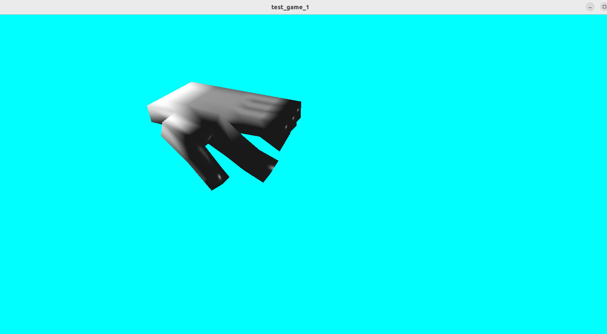

# Custom3DFormat-Dev-GLFW-GLAD

Developing and testing a **custom 3D format** using **GLFW** and **GLAD**.

A small testbed for exploring and validating a self-forming 3D data format through real-time rendering.

---

## Overview

This repository contains code for **loading, running, and testing a custom self-forming 3D file format**.

The meshes used here are intentionally simple, and the resulting animations may appear unusual.
However, the underlying logic is believed to be correct and has remained mostly unchanged since its initial development.

The `.sc3` files are **authored and tested in Blender**, and the same data is used directly in this project.
Within Blender, the files behave as intended.

---

## Requirements

Before building and running this project, ensure the following are installed:

- **OpenGL**
- **GLFW**
- **GLAD**
Libraries required to load `.sc3` files are included inside the `sc3_loader` directory.

---

## Custom 3D Format

- The custom 3D format uses the extension **`.sc3`**
- The example provided in this repository is **`a.sc3`**
- The format is experimental and **its specification may change**
- **Currently supports converting FBX files into the custom `.sc3` format**

---

## Screenshot

Below is an example rendering and playback of `a.sc3` using this project:

---

## Demo Video

This video demonstrates loading and playing back `a.sc3`:

https://github.com/user-attachments/assets/9f9edff9-3dd9-4478-90ed-3bfa1bd60b63

---

## Notes

- This repository is a small **experimental playground**
- Visual quality is rough, but the goal is verifying the **custom 3D format and its runtime behavior**
- Expect simple meshes and work-in-progress features
